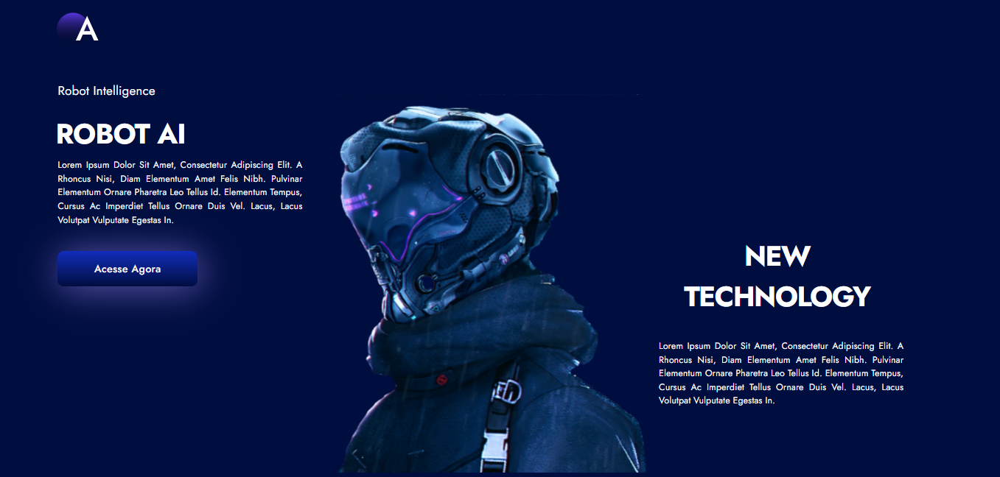

# Robot-website

https://robot-blog.vercel.app/

Design
+ Figma

Frontend
+ React router DOM 
+ Redux
+ Styled component

Backend
API
+ API express - to access the database
+ Mongoose's ORM to manipulate the MongoDB data.
+ CORS to access the API endpoint in the web
+ Bcrypt to cryptography the passwords
+ Nodemon to update in real-time the data

Scraping
+ API express - to access the scrap endpoint
+ CORS to access the API endpoint in the web
+ Puppeteer to scrap the data
+ Nodemon to update in real-time the data
+  https://www.cnbc.com/technology/ : the website that was scrapped

To execute the project:
+ git clone + npm install + npm start

